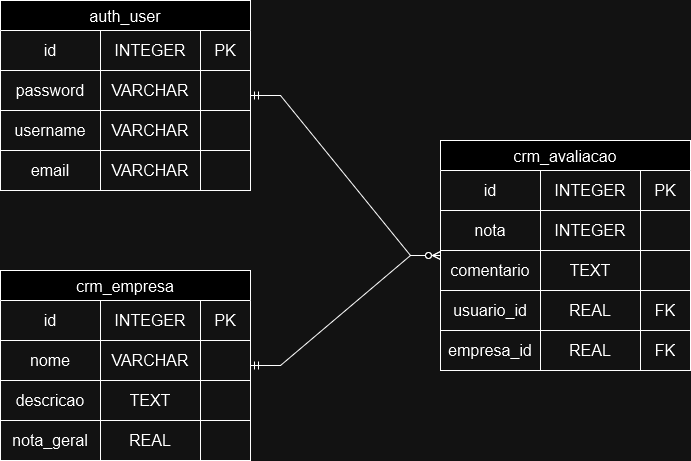

# Projeto django (Seu Cliente Oculto)

Este projeto foi criado como parte do desafio da Seu Cliente Oculto. Este é um projeto de CRM (Customer Relationship Management) desenvolvido em Django. O sistema permite o cadastro, login, gerenciamento de empresas e avaliações de usuários sobre essas empresas.

 - [Diagrama Entidade-Relacionamento](#Diagrama-Entidade---Relacionamento)
 - [Como Abrir o Projeto](#Como-Abrir-o-Projeto)
 - [Funcionalidades](#Funcionalidades)
 - [Tecnilogias Utilizadas](#Tecnologias-Utilizadas)
 - [Estrutura do Projeto](#Estrutura-do-Projeto)
    - [Models](#Models)
    - [Views](#Views)
    - [Forms](#Forms)
    - [Templates](#Templates)

### Diagrama Entidade-Relacionamento

### Como Abrir o Projeto

1. Abra o terminal `(bash)` e navegue até um diretório escolhido;

2. Clonar o repositório:
  `git clone https://github.com/bernardomacedo1/projeto_seu_cliente_oculto.git`

3. Navegar até o diretório do projeto:
  `cd projeto_seu_cliente_oculto`
  
4. Criar e ativar um Ambiente Virtual:
   
  `python -m venv venv`
  `source venv/Scripts/activate`  # Windows
  `source venv/bin/activate`  # macOS/Linux

5. Instalar dependências

  `pip install -r requirements.txt`

6. Inicie o servidor do projeto (pode ser acessado através de "localhost:8000" em um navegador

  `py manage.py runserver`

## Funcionalidades

- **Cadastro e Login de Usuários**: Sistema de autenticação para usuários se registrarem e fazerem login.
- **Gerenciamento de Empresas**: Usuários administradores podem adicionar novas empresas.
- **Avaliação de Empresas**: Usuários podem avaliar empresas, fornecendo uma nota e um comentário.

## Tecnologias Utilizadas

- **Django**: Framework web para o backend.
- **Bootstrap**: Framework CSS para estilização.
- **SQLite**: Banco de dados usado para armazenamento de dados.

# Estrutura do Projeto

#### Models (models.py)

Os modelos representam a estrutura do banco de dados. Neste projeto, temos dois modelos principais:

- `Empresa`: Armazena informações sobre empresas, incluindo nome, descrição e nota geral.
- `Avaliacao`: Armazena avaliações feitas por usuários sobre as empresas, incluindo a nota e o comentário.

#### Views (views.py)

As views contêm a lógica de negócios do app e controlam como os dados são exibidos ao usuário.

- `inicio`: Renderiza a página inicial.
- `registro`: Gerencia o registro de novos usuários.
- `login`: Gerencia o login dos usuários.
- `logout`: Gerencia o logout dos usuários.
- `dashboard`: Exibe uma lista de empresas e permite que administradores adicionem novas empresas.
- `empresa_detail`: mostra os detalhes de uma empresa e suas avaliações, apenas para usuários logados. Se um formulário de avaliação for enviado (POST), ele salva a nova avaliação e recarrega a página.
- `adicionar_empresa`: Permite que usuários logados adicionem novas empresas. Se um formulário de nova empresa for enviado (POST) e válido, ele salva a empresa e redireciona para o dashboard. Caso contrário, só redireciona para o dashboard.

#### Forms (forms.py)

Os formulários são usados para validar e processar dados de entrada do usuário.

- `CriarUsuario`: Formulário para registro de novos usuários.
- `LogarUsuario`: Formulário para login de usuários.
- `EmpresaForm`: Formulário para adicionar novas empresas.
- `AvaliacaoForm`: Formulário para adicionar avaliações de empresas.

#### Templates

Os templates são bastante intuitivos, mas aqui estão alguns comentários adicionais para mais clareza:

- `index.html`: Essa é a página inicial. É a única que pode ser acessada sem autenticação.

- `dashboard.html`: Essa página exibe a lista de empresas. Usuários com permissão de administrador podem criar novas empresas aqui.

- `empresa_detail.html`: Essa página exibe os detalhes de uma empresa, suas avaliações e a nota geral, que é uma média arredondada. Aqui o usuário pode adicionar novas avaliações para a empresa.

Para qualquer dúvida, entre em contato: `bernardomcc2002@gmail.com`
